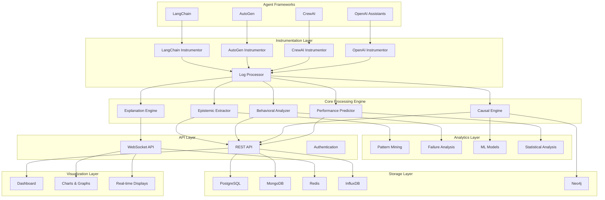

# Design Document

## Overview

The ESCAI (Epistemic State and Causal Analysis Intelligence) Framework is designed as a modular, scalable observability system for monitoring autonomous agent cognition in real-time. The system employs a layered architecture that separates concerns between data collection, processing, analysis, and presentation. The design prioritizes low-latency monitoring, high-throughput data processing, and interpretable insights generation while maintaining minimal performance overhead on monitored agents.

## Architecture

### High-Level Architecture



### System Flow

1. **Data Capture**: Framework-specific instrumentors capture agent execution data
2. **Normalization**: Log processor standardizes data from different frameworks
3. **Processing**: Core engines extract epistemic states, analyze patterns, and generate predictions
4. **Storage**: Multi-database architecture stores different data types optimally
5. **Analysis**: Advanced analytics provide insights and explanations
6. **Presentation**: APIs and visualization layer present results to users

## Components and Interfaces

### Instrumentation Layer

#### BaseInstrumentor (Abstract Interface)

```python
class BaseInstrumentor(ABC):
    @abstractmethod
    async def start_monitoring(self, agent_id: str, config: Dict) -> str

    @abstractmethod
    async def stop_monitoring(self, session_id: str) -> MonitoringSummary

    @abstractmethod
    async def capture_event(self, event: AgentEvent) -> None

    @abstractmethod
    def get_supported_events(self) -> List[EventType]
```

**Key Design Decisions:**

- Abstract base class ensures consistent interface across all framework integrations
- Asynchronous methods support high-throughput monitoring without blocking
- Event-driven architecture allows real-time processing
- Configuration-based setup enables flexible monitoring parameters

#### Framework-Specific Instrumentors

**LangChain Instrumentor**

- Integrates with LangChain's callback system
- Captures chain execution steps, LLM calls, and tool usage
- Extracts reasoning traces from chain-of-thought processes
- Monitors memory usage and context management

**AutoGen Instrumentor**

- Monitors multi-agent conversation flows
- Tracks message passing and role assignments
- Captures group decision-making processes
- Analyzes agent coordination patterns

**CrewAI Instrumentor**

- Tracks task delegation and workflow execution
- Monitors crew collaboration patterns
- Captures role-based performance metrics
- Analyzes skill utilization patterns

**OpenAI Assistants Instrumentor**

- Hooks into function calling mechanisms
- Monitors thread conversations and context
- Tracks tool usage patterns and effectiveness
- Captures assistant reasoning processes

### Core Processing Engine

#### Epistemic State Extractor

```python
class EpistemicExtractor:
    async def extract_beliefs(self, agent_logs: List[LogEntry]) -> List[BeliefState]
    async def extract_knowledge(self, agent_logs: List[LogEntry]) -> KnowledgeState
    async def extract_goals(self, agent_logs: List[LogEntry]) -> GoalState
    async def calculate_confidence(self, content: str) -> float
    async def quantify_uncertainty(self, beliefs: List[BeliefState]) -> float
```

**Processing Pipeline:**

1. NLP analysis using transformer models for semantic understanding
2. Regex patterns for confidence score extraction
3. Knowledge graph construction using NetworkX
4. Temporal belief evolution tracking
5. Uncertainty quantification through entropy measures

#### Behavioral Pattern Analyzer

```python
class BehavioralAnalyzer:
    async def mine_patterns(self, sequences: List[ExecutionSequence]) -> List[BehavioralPattern]
    async def detect_anomalies(self, current_behavior: ExecutionSequence) -> AnomalyScore
    async def cluster_behaviors(self, behaviors: List[ExecutionSequence]) -> List[BehaviorCluster]
    async def correlate_success(self, patterns: List[BehavioralPattern]) -> SuccessCorrelation
```

**Analysis Methods:**

- Sequential pattern mining using PrefixSpan algorithm
- Time series clustering for behavioral sequences
- Statistical significance testing for pattern validation
- Machine learning classifiers for pattern categorization

#### Causal Inference Engine

```python
class CausalEngine:
    async def discover_relationships(self, events: List[TemporalEvent]) -> List[CausalRelationship]
    async def test_granger_causality(self, time_series: TimeSeries) -> GrangerResult
    async def build_causal_graph(self, relationships: List[CausalRelationship]) -> CausalGraph
    async def analyze_interventions(self, graph: CausalGraph, intervention: Intervention) -> InterventionEffect
```

**Causal Analysis Pipeline:**

1. Temporal event sequence analysis
2. Granger causality testing for time series relationships
3. Structural causal model construction
4. Counterfactual reasoning for alternative outcomes
5. Intervention effect estimation

#### Performance Predictor

```python
class PerformancePredictor:
    async def predict_success(self, current_state: EpistemicState) -> PredictionResult
    async def estimate_completion_time(self, execution_history: List[ExecutionStep]) -> TimeEstimate
    async def identify_risk_factors(self, agent_state: AgentState) -> List[RiskFactor]
    async def recommend_interventions(self, prediction: PredictionResult) -> List[Intervention]
```

**Prediction Models:**

- LSTM networks for sequence prediction
- Random Forest for ensemble predictions
- XGBoost for gradient boosting
- Attention mechanisms for important step identification

### API Layer

#### REST API Endpoints

```python
# Monitoring Operations
POST /api/v1/monitor/start
GET /api/v1/monitor/{session_id}/status
POST /api/v1/monitor/{session_id}/stop

# Analysis Operations
GET /api/v1/epistemic/{agent_id}/current
GET /api/v1/patterns/{agent_id}/analyze
POST /api/v1/causal/analyze
GET /api/v1/predictions/{agent_id}/current
GET /api/v1/explain/{agent_id}/behavior
```

#### WebSocket API

```python
# Real-time Streams
WS /ws/monitor/{session_id}
# Events: epistemic_update, pattern_detected, prediction_update, alert
```

**API Design Principles:**

- RESTful design for stateless operations
- WebSocket for real-time streaming
- JWT authentication with role-based access control
- Rate limiting and request validation
- Comprehensive error handling and status codes

## Data Models

### Core Data Structures

#### EpistemicState

```python
@dataclass
class EpistemicState:
    agent_id: str
    timestamp: datetime
    belief_states: List[BeliefState]
    knowledge_state: KnowledgeState
    goal_state: GoalState
    confidence_level: float
    uncertainty_score: float
    decision_context: Dict[str, Any]

    def to_dict(self) -> Dict[str, Any]
    def from_dict(cls, data: Dict[str, Any]) -> 'EpistemicState'
    def validate(self) -> bool
```

#### BehavioralPattern

```python
@dataclass
class BehavioralPattern:
    pattern_id: str
    pattern_name: str
    execution_sequences: List[ExecutionSequence]
    frequency: int
    success_rate: float
    average_duration: float
    common_triggers: List[str]
    failure_modes: List[str]
    statistical_significance: float
```

#### CausalRelationship

```python
@dataclass
class CausalRelationship:
    cause_event: str
    effect_event: str
    strength: float
    confidence: float
    delay_ms: int
    evidence: List[str]
    statistical_significance: float
    causal_mechanism: Optional[str]
```

### Database Schema Design

#### PostgreSQL (Structured Data)

- **agents**: Agent registry and metadata
- **epistemic_states**: Time-series epistemic state data
- **behavioral_patterns**: Identified patterns and metadata
- **predictions**: Prediction results and accuracy tracking
- **causal_relationships**: Discovered causal links
- **monitoring_sessions**: Session tracking and configuration

#### MongoDB (Unstructured Data)

- **raw_logs**: Original agent execution logs
- **processed_events**: Normalized event streams
- **explanations**: Generated natural language explanations
- **configuration**: System and user configurations

#### Redis (Caching and Real-time)

- Session management and authentication tokens
- Real-time data caching for WebSocket connections
- Rate limiting counters
- Temporary computation results

#### InfluxDB (Time-series Metrics)

- Performance metrics and system monitoring
- Agent execution timing data
- Resource utilization metrics
- API response times and throughput

#### Neo4j (Graph Data)

- Causal relationship graphs
- Knowledge graphs from agent reasoning
- Agent interaction networks
- Dependency relationships

## Error Handling

### Error Categories and Strategies

#### Instrumentation Errors

- **Framework API Changes**: Abstract interface design with version compatibility
- **Connection Failures**: Retry mechanisms with exponential backoff
- **Data Corruption**: Validation and sanitization at ingestion points
- **Performance Overhead**: Circuit breaker pattern to disable monitoring if overhead exceeds thresholds

#### Processing Errors

- **NLP Model Failures**: Fallback to rule-based extraction methods
- **Pattern Recognition Errors**: Confidence thresholds and human validation loops
- **Causal Analysis Failures**: Statistical significance testing and uncertainty quantification
- **Prediction Model Errors**: Ensemble methods and confidence intervals

#### Storage Errors

- **Database Connection Issues**: Connection pooling and automatic failover
- **Data Consistency**: ACID transactions and eventual consistency patterns
- **Storage Capacity**: Automated data archival and cleanup policies
- **Query Performance**: Indexing strategies and query optimization

#### API Errors

- **Rate Limiting**: Graceful degradation and client notification
- **Authentication Failures**: Clear error messages and token refresh mechanisms
- **Validation Errors**: Detailed field-level error reporting
- **Timeout Handling**: Asynchronous processing with status polling

### Error Recovery Mechanisms

```python
class ErrorHandler:
    async def handle_instrumentation_error(self, error: InstrumentationError) -> RecoveryAction
    async def handle_processing_error(self, error: ProcessingError) -> RecoveryAction
    async def handle_storage_error(self, error: StorageError) -> RecoveryAction
    async def handle_api_error(self, error: APIError) -> ErrorResponse
```

## Testing Strategy

### Testing Pyramid

#### Unit Tests (70%)

- Individual component functionality
- Data model validation
- Algorithm correctness
- Error handling scenarios
- Performance benchmarks

#### Integration Tests (20%)

- Framework instrumentor integration
- Database connectivity and operations
- API endpoint functionality
- WebSocket connection handling
- Cross-component data flow

#### End-to-End Tests (10%)

- Complete monitoring workflows
- Multi-agent scenario testing
- Performance under load
- Failure recovery scenarios
- User interface functionality

### Test Data Strategy

#### Synthetic Data Generation

- Simulated agent execution logs for all supported frameworks
- Generated epistemic state sequences with known patterns
- Synthetic causal relationships with controlled parameters
- Performance test scenarios with varying loads

#### Real-world Data Collection

- Anonymized agent execution logs from partner organizations
- Historical data from production agent deployments
- Edge cases and failure scenarios from real deployments
- Benchmark datasets for comparison with existing tools

### Performance Testing

#### Monitoring Overhead Testing

- Baseline agent performance measurement
- Instrumented agent performance measurement
- Overhead calculation and optimization
- Resource utilization monitoring

#### Scalability Testing

- Concurrent agent monitoring capacity
- API throughput and response time testing
- Database performance under load
- WebSocket connection scaling

#### Accuracy Testing

- Prediction model validation with cross-validation
- Pattern recognition accuracy measurement
- Causal inference validation against known relationships
- Explanation quality assessment with human evaluators

This design provides a comprehensive blueprint for implementing the ESCAI framework with clear architectural decisions, component interfaces, and implementation strategies that address all the requirements while maintaining scalability, performance, and reliability.
