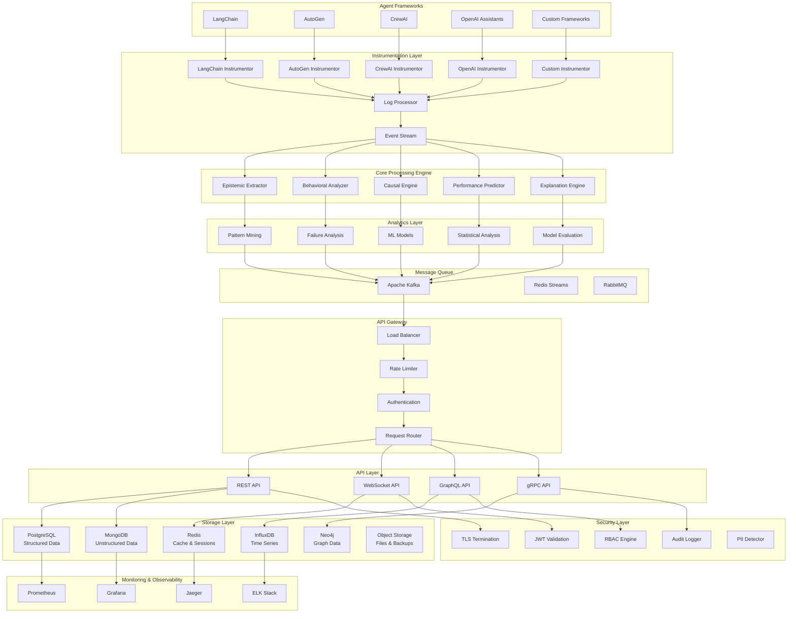
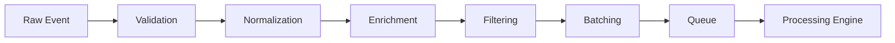
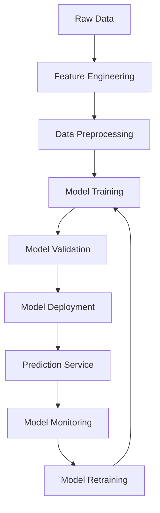
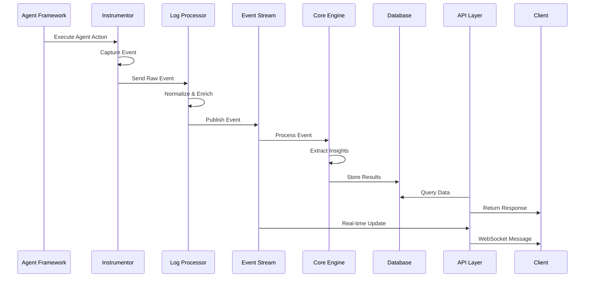
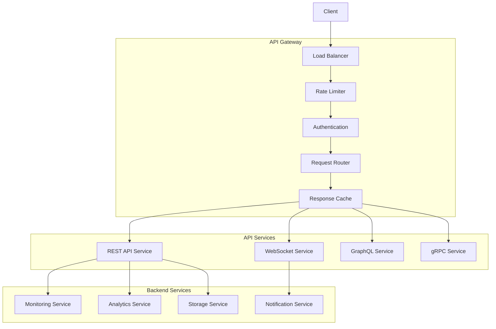
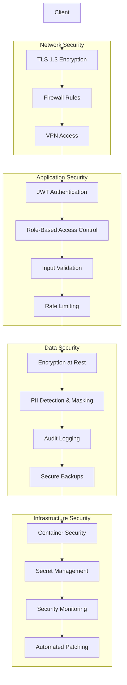

# ESCAI Framework Architecture

This document provides a comprehensive overview of the ESCAI Framework's architecture, design principles, and component interactions.

## Table of Contents

- [Overview](#overview)
- [System Architecture](#system-architecture)
- [Core Components](#core-components)
- [Data Flow](#data-flow)
- [Storage Architecture](#storage-architecture)
- [API Architecture](#api-architecture)
- [Security Architecture](#security-architecture)
- [Deployment Architecture](#deployment-architecture)
- [Scalability and Performance](#scalability-and-performance)

## Overview

The ESCAI (Epistemic State and Causal Analysis Intelligence) Framework is designed as a modular, scalable observability system for monitoring autonomous agent cognition in real-time. The architecture follows microservices principles with clear separation of concerns, enabling independent scaling and maintenance of different components.

### Design Principles

1. **Modularity**: Each component has a single responsibility and well-defined interfaces
2. **Scalability**: Horizontal scaling support for high-throughput scenarios
3. **Extensibility**: Plugin architecture for custom frameworks and analysis methods
4. **Reliability**: Fault tolerance and graceful degradation capabilities
5. **Performance**: Low-latency monitoring with minimal overhead
6. **Security**: Defense in depth with encryption, authentication, and audit logging

## System Architecture

### High-Level Architecture Diagram



### Component Interaction Flow

1. **Data Ingestion**: Agent frameworks send execution data to instrumentors
2. **Processing**: Log processor normalizes and enriches data
3. **Analysis**: Core engines extract insights and patterns
4. **Storage**: Processed data is stored in appropriate databases
5. **API Access**: REST/WebSocket APIs provide access to insights
6. **Real-time Updates**: WebSocket connections stream live updates

## Core Components

### 1. Instrumentation Layer

The instrumentation layer captures agent execution data with minimal performance impact.

#### Base Instrumentor

```python
class BaseInstrumentor(ABC):
    """Abstract base class for all instrumentors."""

    def __init__(self, config: InstrumentorConfig):
        self.config = config
        self.event_buffer = CircularBuffer(config.buffer_size)
        self.processor = EventProcessor()

    @abstractmethod
    async def start_monitoring(self, agent_id: str) -> str:
        """Start monitoring an agent."""
        pass

    @abstractmethod
    async def stop_monitoring(self, session_id: str) -> MonitoringSummary:
        """Stop monitoring and return summary."""
        pass

    @abstractmethod
    async def capture_event(self, event: AgentEvent) -> None:
        """Capture an agent event."""
        pass
```

#### Event Processing Pipeline



### 2. Core Processing Engine

The core processing engine extracts insights from normalized agent data.

#### Epistemic State Extractor

```python
class EpistemicExtractor:
    """Extracts epistemic states from agent execution data."""

    def __init__(self, nlp_model: str = "sentence-transformers/all-MiniLM-L6-v2"):
        self.nlp = SentenceTransformer(nlp_model)
        self.belief_extractor = BeliefExtractor()
        self.knowledge_extractor = KnowledgeExtractor()
        self.goal_extractor = GoalExtractor()

    async def extract_epistemic_state(self,
                                    agent_logs: List[LogEntry]) -> EpistemicState:
        """Extract epistemic state from agent logs."""

        # Extract beliefs using NLP
        beliefs = await self.belief_extractor.extract(agent_logs)

        # Extract knowledge using graph analysis
        knowledge = await self.knowledge_extractor.extract(agent_logs)

        # Extract goals using pattern matching
        goals = await self.goal_extractor.extract(agent_logs)

        # Calculate confidence and uncertainty
        confidence = self._calculate_confidence(beliefs, knowledge, goals)
        uncertainty = self._calculate_uncertainty(beliefs)

        return EpistemicState(
            beliefs=beliefs,
            knowledge=knowledge,
            goals=goals,
            confidence=confidence,
            uncertainty=uncertainty,
            timestamp=datetime.utcnow()
        )
```

#### Behavioral Pattern Analyzer

```python
class BehavioralAnalyzer:
    """Analyzes behavioral patterns in agent execution."""

    def __init__(self):
        self.pattern_miner = PrefixSpanMiner()
        self.anomaly_detector = IsolationForest()
        self.clusterer = KMeans(n_clusters=10)

    async def analyze_patterns(self,
                             sequences: List[ExecutionSequence]) -> List[BehavioralPattern]:
        """Analyze behavioral patterns in execution sequences."""

        # Mine frequent patterns
        frequent_patterns = self.pattern_miner.mine(sequences)

        # Detect anomalies
        anomalies = self.anomaly_detector.detect(sequences)

        # Cluster similar behaviors
        clusters = self.clusterer.cluster(sequences)

        return self._create_pattern_objects(frequent_patterns, anomalies, clusters)
```

### 3. Analytics Layer

The analytics layer provides advanced machine learning and statistical analysis.

#### Machine Learning Pipeline



#### Prediction Models

```python
class PerformancePredictor:
    """Predicts agent performance using ML models."""

    def __init__(self):
        self.models = {
            'success_probability': LSTMModel(),
            'completion_time': RandomForestRegressor(),
            'failure_risk': XGBoostClassifier()
        }
        self.feature_extractor = FeatureExtractor()

    async def predict(self,
                     current_state: EpistemicState,
                     execution_history: List[ExecutionStep]) -> PredictionResult:
        """Generate performance predictions."""

        # Extract features
        features = self.feature_extractor.extract(current_state, execution_history)

        # Generate predictions
        predictions = {}
        for model_name, model in self.models.items():
            prediction = model.predict(features)
            confidence = model.predict_proba(features).max()
            predictions[model_name] = {
                'value': prediction,
                'confidence': confidence
            }

        return PredictionResult(
            predictions=predictions,
            features=features,
            timestamp=datetime.utcnow()
        )
```

## Data Flow

### Event Processing Flow



### Data Processing Stages

1. **Capture**: Instrumentors capture raw agent execution data
2. **Normalization**: Log processor standardizes data format
3. **Enrichment**: Additional context and metadata added
4. **Analysis**: Core engines extract insights and patterns
5. **Storage**: Results stored in appropriate databases
6. **Retrieval**: APIs provide access to processed data

## Storage Architecture

### Multi-Database Strategy

The ESCAI Framework uses a polyglot persistence approach with different databases optimized for specific data types:

#### PostgreSQL - Structured Data

```sql
-- Agent registry and metadata
CREATE TABLE agents (
    id UUID PRIMARY KEY,
    name VARCHAR(255) NOT NULL,
    framework VARCHAR(50) NOT NULL,
    created_at TIMESTAMP DEFAULT NOW(),
    updated_at TIMESTAMP DEFAULT NOW()
);

-- Epistemic states
CREATE TABLE epistemic_states (
    id UUID PRIMARY KEY,
    agent_id UUID REFERENCES agents(id),
    beliefs JSONB,
    knowledge JSONB,
    goals JSONB,
    confidence FLOAT,
    uncertainty FLOAT,
    timestamp TIMESTAMP DEFAULT NOW()
);

-- Behavioral patterns
CREATE TABLE behavioral_patterns (
    id UUID PRIMARY KEY,
    pattern_name VARCHAR(255),
    execution_sequences JSONB,
    frequency INTEGER,
    success_rate FLOAT,
    statistical_significance FLOAT,
    created_at TIMESTAMP DEFAULT NOW()
);
```

#### MongoDB - Unstructured Data

```javascript
// Raw agent logs collection
db.raw_logs.createIndex({ agent_id: 1, timestamp: 1 });
db.raw_logs.createIndex({ session_id: 1 });
db.raw_logs.createIndex({ timestamp: 1 });

// Processed events collection
db.processed_events.createIndex({ agent_id: 1, event_type: 1, timestamp: 1 });
db.processed_events.createIndex({ session_id: 1, timestamp: 1 });

// Explanations collection
db.explanations.createIndex({ agent_id: 1, explanation_type: 1 });
```

#### Redis - Caching and Sessions

```redis
# Session management
SET session:12345 '{"agent_id": "agent-001", "status": "active"}'
EXPIRE session:12345 3600

# Real-time data caching
HSET agent:agent-001:current confidence 0.85
HSET agent:agent-001:current uncertainty 0.15
EXPIRE agent:agent-001:current 300

# Rate limiting
INCR rate_limit:user:123:minute
EXPIRE rate_limit:user:123:minute 60
```

#### InfluxDB - Time Series Metrics

```sql
-- Performance metrics
CREATE MEASUREMENT performance_metrics (
    time TIMESTAMP,
    agent_id TAG,
    session_id TAG,
    metric_name TAG,
    value FLOAT
);

-- System metrics
CREATE MEASUREMENT system_metrics (
    time TIMESTAMP,
    component TAG,
    instance TAG,
    metric_name TAG,
    value FLOAT
);
```

#### Neo4j - Graph Data

```cypher
// Causal relationships
CREATE (cause:Event {id: 'event-001', type: 'decision_made'})
CREATE (effect:Event {id: 'event-002', type: 'action_taken'})
CREATE (cause)-[:CAUSES {strength: 0.85, confidence: 0.92}]->(effect)

// Knowledge graphs
CREATE (concept:Concept {name: 'machine_learning'})
CREATE (fact:Fact {content: 'ML models require training data'})
CREATE (concept)-[:HAS_FACT]->(fact)
```

### Data Partitioning Strategy

```python
class DataPartitioningStrategy:
    """Manages data partitioning across storage systems."""

    def __init__(self):
        self.partition_rules = {
            'hot_data': {
                'age_threshold': timedelta(days=7),
                'storage': 'redis',
                'access_pattern': 'high_frequency'
            },
            'warm_data': {
                'age_threshold': timedelta(days=30),
                'storage': 'postgresql',
                'access_pattern': 'medium_frequency'
            },
            'cold_data': {
                'age_threshold': timedelta(days=365),
                'storage': 'object_storage',
                'access_pattern': 'low_frequency'
            }
        }

    def determine_storage(self, data_age: timedelta, access_frequency: str) -> str:
        """Determine appropriate storage based on data characteristics."""
        for partition_type, rules in self.partition_rules.items():
            if (data_age <= rules['age_threshold'] and
                access_frequency == rules['access_pattern']):
                return rules['storage']
        return 'object_storage'  # Default to cold storage
```

## API Architecture

### RESTful API Design

The ESCAI Framework follows REST principles with clear resource hierarchies:

```
/api/v1/
├── agents/                     # Agent management
│   ├── {agent_id}/
│   │   ├── epistemic/         # Epistemic states
│   │   ├── patterns/          # Behavioral patterns
│   │   ├── predictions/       # Performance predictions
│   │   └── explanations/      # Behavior explanations
├── monitoring/                 # Monitoring sessions
│   ├── sessions/
│   │   └── {session_id}/
├── analytics/                  # Analytics endpoints
│   ├── patterns/
│   ├── causal/
│   └── performance/
└── admin/                      # Administrative endpoints
    ├── health/
    ├── metrics/
    └── config/
```

### API Gateway Architecture



### WebSocket Architecture

```python
class WebSocketManager:
    """Manages WebSocket connections and real-time updates."""

    def __init__(self):
        self.connections: Dict[str, WebSocket] = {}
        self.subscriptions: Dict[str, Set[str]] = {}
        self.message_queue = asyncio.Queue()

    async def connect(self, websocket: WebSocket, session_id: str):
        """Handle new WebSocket connection."""
        await websocket.accept()
        self.connections[session_id] = websocket

        # Start message processing for this connection
        asyncio.create_task(self._process_messages(session_id))

    async def broadcast_update(self, update: RealtimeUpdate):
        """Broadcast update to subscribed connections."""
        message = {
            "type": update.type,
            "payload": update.payload,
            "timestamp": update.timestamp.isoformat()
        }

        # Send to all subscribed connections
        for session_id in self.subscriptions.get(update.agent_id, set()):
            if session_id in self.connections:
                await self.connections[session_id].send_json(message)
```

## Security Architecture

### Defense in Depth

The ESCAI Framework implements multiple layers of security:



### Authentication and Authorization

```python
class SecurityManager:
    """Manages authentication and authorization."""

    def __init__(self):
        self.jwt_handler = JWTHandler()
        self.rbac_engine = RBACEngine()
        self.audit_logger = AuditLogger()

    async def authenticate(self, credentials: Credentials) -> AuthResult:
        """Authenticate user credentials."""
        user = await self._validate_credentials(credentials)
        if user:
            token = self.jwt_handler.create_token(user)
            await self.audit_logger.log_authentication(user.id, success=True)
            return AuthResult(success=True, token=token, user=user)
        else:
            await self.audit_logger.log_authentication(credentials.username, success=False)
            return AuthResult(success=False, error="Invalid credentials")

    async def authorize(self, user: User, resource: str, action: str) -> bool:
        """Check if user is authorized for action on resource."""
        permission = await self.rbac_engine.check_permission(user, resource, action)
        await self.audit_logger.log_authorization(user.id, resource, action, permission)
        return permission
```

## Deployment Architecture

### Container Architecture

```dockerfile
# Multi-stage build for optimized container size
FROM python:3.9-slim as builder
WORKDIR /app
COPY requirements.txt .
RUN pip install --no-cache-dir -r requirements.txt

FROM python:3.9-slim as runtime
WORKDIR /app
COPY --from=builder /usr/local/lib/python3.9/site-packages /usr/local/lib/python3.9/site-packages
COPY . .

# Security: Run as non-root user
RUN groupadd -r escai && useradd -r -g escai escai
USER escai

# Health check
HEALTHCHECK --interval=30s --timeout=10s --start-period=5s --retries=3 \
    CMD curl -f http://localhost:8000/health || exit 1

EXPOSE 8000
CMD ["uvicorn", "escai_framework.api.main:app", "--host", "0.0.0.0", "--port", "8000"]
```

### Kubernetes Architecture

```yaml
# Deployment with horizontal pod autoscaling
apiVersion: apps/v1
kind: Deployment
metadata:
  name: escai-api
spec:
  replicas: 3
  selector:
    matchLabels:
      app: escai-api
  template:
    metadata:
      labels:
        app: escai-api
    spec:
      containers:
        - name: escai-api
          image: escai/escai-framework:latest
          ports:
            - containerPort: 8000
          resources:
            requests:
              memory: "1Gi"
              cpu: "500m"
            limits:
              memory: "2Gi"
              cpu: "1000m"
          livenessProbe:
            httpGet:
              path: /health
              port: 8000
            initialDelaySeconds: 30
            periodSeconds: 10
          readinessProbe:
            httpGet:
              path: /ready
              port: 8000
            initialDelaySeconds: 5
            periodSeconds: 5

---
apiVersion: autoscaling/v2
kind: HorizontalPodAutoscaler
metadata:
  name: escai-api-hpa
spec:
  scaleTargetRef:
    apiVersion: apps/v1
    kind: Deployment
    name: escai-api
  minReplicas: 3
  maxReplicas: 10
  metrics:
    - type: Resource
      resource:
        name: cpu
        target:
          type: Utilization
          averageUtilization: 70
    - type: Resource
      resource:
        name: memory
        target:
          type: Utilization
          averageUtilization: 80
```

## Scalability and Performance

### Horizontal Scaling Strategy

```python
class ScalingManager:
    """Manages horizontal scaling of ESCAI components."""

    def __init__(self):
        self.metrics_collector = MetricsCollector()
        self.scaling_policies = {
            'api_service': {
                'min_replicas': 3,
                'max_replicas': 20,
                'cpu_threshold': 70,
                'memory_threshold': 80,
                'scale_up_cooldown': 300,
                'scale_down_cooldown': 600
            },
            'processing_service': {
                'min_replicas': 2,
                'max_replicas': 15,
                'queue_length_threshold': 1000,
                'processing_time_threshold': 5000
            }
        }

    async def evaluate_scaling(self, service: str) -> ScalingDecision:
        """Evaluate if scaling is needed for a service."""
        metrics = await self.metrics_collector.get_metrics(service)
        policy = self.scaling_policies[service]

        if self._should_scale_up(metrics, policy):
            return ScalingDecision(action='scale_up', target_replicas=metrics.current_replicas + 1)
        elif self._should_scale_down(metrics, policy):
            return ScalingDecision(action='scale_down', target_replicas=metrics.current_replicas - 1)
        else:
            return ScalingDecision(action='no_change', target_replicas=metrics.current_replicas)
```

### Performance Optimization

#### Caching Strategy

```python
class CacheManager:
    """Manages multi-level caching for performance optimization."""

    def __init__(self):
        self.l1_cache = LRUCache(maxsize=1000)  # In-memory cache
        self.l2_cache = RedisCache()            # Distributed cache
        self.l3_cache = DatabaseCache()         # Database query cache

    async def get(self, key: str) -> Optional[Any]:
        """Get value from cache with fallback strategy."""
        # Try L1 cache first
        value = self.l1_cache.get(key)
        if value is not None:
            return value

        # Try L2 cache
        value = await self.l2_cache.get(key)
        if value is not None:
            self.l1_cache.set(key, value)
            return value

        # Try L3 cache
        value = await self.l3_cache.get(key)
        if value is not None:
            self.l1_cache.set(key, value)
            await self.l2_cache.set(key, value, ttl=300)
            return value

        return None
```

#### Database Optimization

```python
class DatabaseOptimizer:
    """Optimizes database performance through various strategies."""

    def __init__(self):
        self.connection_pool = ConnectionPool(
            min_connections=10,
            max_connections=100,
            connection_timeout=30
        )
        self.query_cache = QueryCache()
        self.index_advisor = IndexAdvisor()

    async def optimize_query(self, query: str, params: Dict) -> QueryResult:
        """Optimize query execution with caching and indexing."""
        # Check query cache first
        cache_key = self._generate_cache_key(query, params)
        cached_result = await self.query_cache.get(cache_key)
        if cached_result:
            return cached_result

        # Analyze query for index recommendations
        index_recommendations = self.index_advisor.analyze(query)
        if index_recommendations:
            await self._apply_index_recommendations(index_recommendations)

        # Execute optimized query
        result = await self._execute_query(query, params)

        # Cache result if appropriate
        if self._should_cache_result(query, result):
            await self.query_cache.set(cache_key, result, ttl=600)

        return result
```

### Monitoring and Observability

```python
class ObservabilityManager:
    """Manages system observability and monitoring."""

    def __init__(self):
        self.metrics_registry = MetricsRegistry()
        self.tracer = JaegerTracer()
        self.logger = StructuredLogger()

    def instrument_function(self, func):
        """Decorator to instrument functions with metrics and tracing."""
        @wraps(func)
        async def wrapper(*args, **kwargs):
            # Start trace
            with self.tracer.start_span(func.__name__) as span:
                # Record metrics
                start_time = time.time()

                try:
                    result = await func(*args, **kwargs)

                    # Record success metrics
                    duration = time.time() - start_time
                    self.metrics_registry.histogram('function_duration', duration,
                                                  labels={'function': func.__name__, 'status': 'success'})

                    span.set_tag('status', 'success')
                    return result

                except Exception as e:
                    # Record error metrics
                    duration = time.time() - start_time
                    self.metrics_registry.histogram('function_duration', duration,
                                                  labels={'function': func.__name__, 'status': 'error'})
                    self.metrics_registry.counter('function_errors',
                                                labels={'function': func.__name__, 'error_type': type(e).__name__})

                    span.set_tag('status', 'error')
                    span.set_tag('error', str(e))

                    # Log error
                    self.logger.error(f"Function {func.__name__} failed",
                                    error=str(e), duration=duration)
                    raise

        return wrapper
```

## Conclusion

The ESCAI Framework architecture is designed to provide scalable, reliable, and secure monitoring of autonomous agent cognition. The modular design allows for independent scaling and maintenance of components, while the multi-database approach optimizes storage for different data types and access patterns.

Key architectural strengths:

1. **Modularity**: Clear separation of concerns enables independent development and scaling
2. **Scalability**: Horizontal scaling support handles high-throughput scenarios
3. **Performance**: Multi-level caching and database optimization minimize latency
4. **Security**: Defense-in-depth approach protects against various threats
5. **Observability**: Comprehensive monitoring and tracing enable operational excellence
6. **Extensibility**: Plugin architecture supports custom frameworks and analysis methods

This architecture provides a solid foundation for monitoring autonomous agents at scale while maintaining the flexibility to adapt to evolving requirements and technologies.
